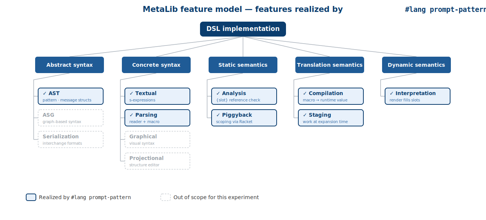

# `#lang prompt-pattern`

A hosted DSL in **Racket** for declaring LLM prompt patterns — built as a
metaprogramming experiment for the SLE 2026 course at the University of
Koblenz (assignment 2 of 3).

The experiment extends the **MetaLib chrestomathy methodology**
(Schauss, Lämmel, Härtel, Heinz, Klein, Härtel, Berger,
[*A Chrestomathy of DSL Implementations*][metalib-paper], SLE 2017)
from the FSML domain to the **prompt-engineering** domain — one new
chrestomathy member, in the spirit of [MetaLib's `racket` member][metalib-racket].

[metalib-paper]: https://dl.acm.org/doi/10.1145/3136014.3136038
[metalib-racket]: https://github.com/softlang/metalib/tree/master/racket

## What it looks like

```racket
#lang prompt-pattern

(define-pattern support-bot
  #:slots (question company)
  (system "You are a support agent for {company}. Be concise.")
  (user "How do I get a refund?")
  (assistant "Go to Settings -> Billing -> Refund.")
  (user "{question}"))

(render support-bot
        #:company  "Acme"
        #:question "Where do I find my invoice?")
```

The expression returns a list of `{role, content}` records (a Racket
`jsexpr`) in the chat-completion shape — one `jsexpr->string` away from an
API-ready request body.

If a template references a slot that is **not** declared in `#:slots`, the
program fails to compile — the check runs at macro-expansion time, not at
runtime — and, like a real compiler, the error points at the offending line
in *your* file (see [`examples/bad-pattern.rkt`](examples/bad-pattern.rkt)):

```
examples/bad-pattern.rkt:9:2: define-pattern: slot {missing} is referenced
  in a template but not declared in #:slots (name)
  in: (user "Hello {name}, your account balance is {missing}.")
```

## Build & run

```bash
# 1. install the package (one-time, idempotent)
make install

# 2. run the tests
make test

# 3. run the demos
make demo        # examples/greeting.rkt
make few-shot    # examples/few-shot.rkt
make chain       # examples/chained.rkt — prompt chaining + JSON output
make bad         # examples/bad-pattern.rkt — intentionally fails at compile time
```

## Feature coverage (MetaLib feature model)

The diagram and table below mirror the feature model from
[MetaLib's Figure 2 / Section 4][metalib-paper] so that the experiment
is directly comparable to other chrestomathy members.



| MetaLib feature                                     | Realization in `#lang prompt-pattern`                                |
| --------------------------------------------------- | -------------------------------------------------------------------- |
| Abstract syntax — AST                               | `pattern` and `message` structs in [main.rkt](prompt-pattern/main.rkt) |
| Concrete syntax — textual                           | s-expression surface syntax under a custom `#lang`                   |
| Parsing — Text-to-AST                               | Racket's reader plus the `define-pattern` macro                      |
| Static semantics — Analysis                         | Compile-time check that every `{slot}` reference is declared         |
| Static semantics — Piggyback                        | Identifier binding is delegated to Racket's lexical scope            |
| Translation semantics — Compilation                 | `define-pattern` expands to a `define` of a runtime `pattern` value  |
| Translation semantics — Staging                     | Slot references are extracted at expansion time, not run time        |
| Dynamic semantics — Interpretation                  | `render` fills templates with the supplied keyword arguments         |

## Where this sits in the prompt-engineering DSL space

| Approach                                       | Style                          | Slot well-formedness checked at |
| ---------------------------------------------- | ------------------------------ | ------------------------------- |
| **Impromptu** (Clarisó & Cabot, MODELS 2023)   | external DSL via **Langium**   | parse / validator time          |
| **DSPy** (Khattab et al., 2023)                | embedded Python programming model | run time                     |
| **`#lang prompt-pattern`** (this experiment)   | hosted DSL via **Racket** macros | **macro-expansion time**        |

The methodological frame is MetaLib. The contribution of this experiment
is one chrestomathy member — a Racket-hosted realization — in a design
space where the existing tools sit at either end (Langium's
grammar-workbench DSL and DSPy's embedded programming model).

## Repository

[github.com/VivekanandaReddy3/sle-prompt-pattern](https://github.com/VivekanandaReddy3/sle-prompt-pattern)

## Repository layout

```
sle-prompt-pattern/
├── README.md                       this file
├── Makefile
├── feature-model.svg               MetaLib feature model (coverage diagram)
├── slides.md / slides.pdf          presentation (Marp source + export)
├── examples/                       sample programs in `#lang prompt-pattern`
│   ├── greeting.rkt
│   ├── few-shot.rkt
│   ├── chained.rkt                 prompt chaining + JSON interchange
│   └── bad-pattern.rkt             intentionally fails at compile time
└── prompt-pattern/                 the Racket package
    ├── info.rkt                    package metadata
    ├── main.rkt                    AST + macro + render
    ├── lang/
    │   └── reader.rkt              `#lang prompt-pattern` reader
    ├── tests.rkt                   rackunit tests
    └── usage.rkt                   plain-Racket usage demo
```

## References

- Schauss, Lämmel, Härtel, Heinz, Klein, Härtel, Berger.
  *A Chrestomathy of DSL Implementations.* SLE 2017.
  [doi:10.1145/3136014.3136038](https://doi.org/10.1145/3136014.3136038)
- Clarisó, Cabot. *Model-Driven Prompt Engineering.* MODELS 2023.
  [doi:10.1109/MODELS58315.2023.00020](https://doi.org/10.1109/MODELS58315.2023.00020).
  Toolkit: [SOM-Research/Impromptu](https://github.com/SOM-Research/Impromptu).
- Khattab et al. *DSPy: Compiling Declarative Language Model Calls into
  Self-Improving Pipelines.* 2023.
  [arXiv:2310.03714](https://arxiv.org/abs/2310.03714).
  Toolkit: [stanfordnlp/dspy](https://github.com/stanfordnlp/dspy).
- Racket and `#lang`: [Beautiful Racket](https://beautifulracket.com/) by Matthew Butterick.
